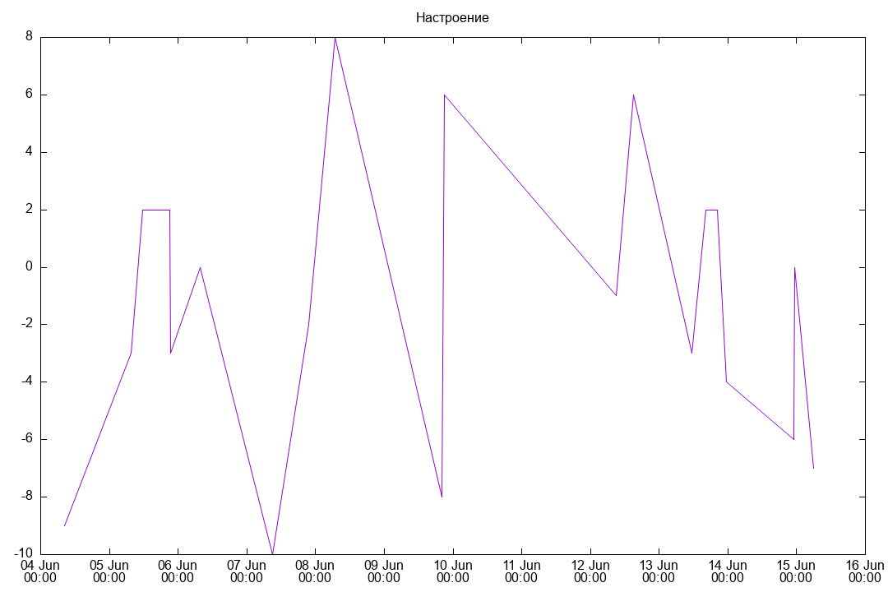

# gnuplot-kt

A convenient wrapper around `gnuplot` CLI Application.

We have no intent in providing any extensions on top of it. We only support
type-safe and Kotlin-friendly APIs for the existing tool.

ATM only supports JVM, but native platforms may be added as needed.

## Gnuplot

Underlying library documentation can be found here:
[Gnuplot Manual](http://www.gnuplot.info/docs_6.1/Gnuplot_6.pdf).

It's LaTeX PDF 337 pages long, and obviously I didn't read this. I am Gen Z
NGL can't read fr fr.

So, this library is very simple. Just a wrapper around command-line stuff.

## Example

Run `./gradlew jvmMain -PmainClass=gnuplut.MainKt` and you will get
`output.png` with generated chart:



Code for this example is located under:
[Main.kt](src/jvmMain/kotlin/gnuplot/Main.kt)

## Usage

Library is available on Maven Central:

```gradle
dependencies {
    implementation("me.y9san9.gnuplot:core:$version")
}
```

`$version` is the last one from releases.

